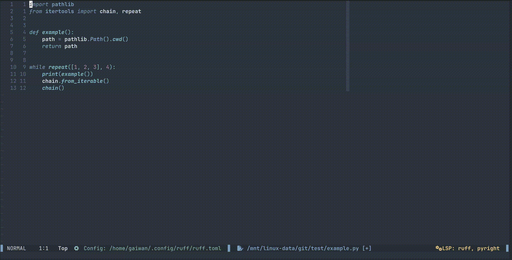

<div align="center">

  <h1>nvim-language-doc</h1>
  <h5>Language reference docs directly in nvim.</h5>

[](http://www.lua.org)
[](https://neovim.io)

</div>


## Installation

### Requirements

- Neovim 0.10
- Treesitter

### Setup - Lazy

```lua
return {
  "gaiwan-dev/nvim-language-doc",
  branch = "master",

  config = function()
    local lang_doc = require("nvim-language-doc")
    lang_doc.setup({
      lsp = {
        ruff = "pydoc",
        pyright = "pydoc",
      },
    })
  end,
  vim.keymap.set("n", "<leader>p", "<cmd>ShowDocs<cr>"),
}
```

Every entry of `lsp` should match the name of your lsp and the command that you need to invoke from the command line to view the language reference of the related language.
If a language does not have this feature, it is automatically not supported. 

Full config:

```lua
lang_doc.setup({
    lsp = {
        ruff = "pydoc",
        pyright = "pydoc",
    },
    window = { position = "right" },
})
```

`window.postion` determins where the window will be opened. Default to `right`.

### Language Support

Currently the only language fully supported is python, with all the parsing and import recognition done in `lua/nvim-language-doc/languages/python.lua`.

### Working Example




